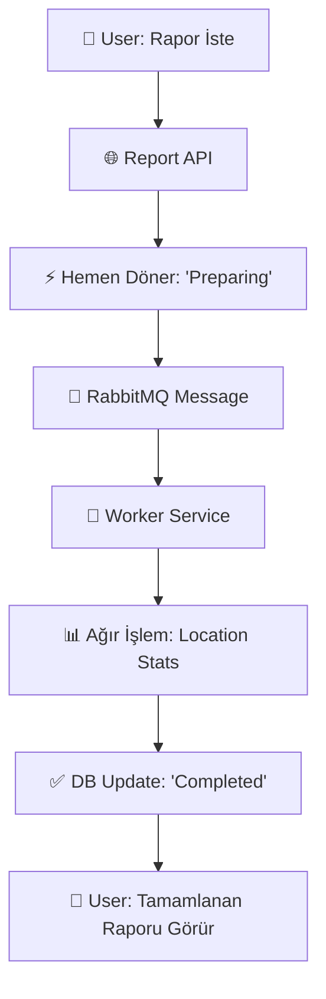
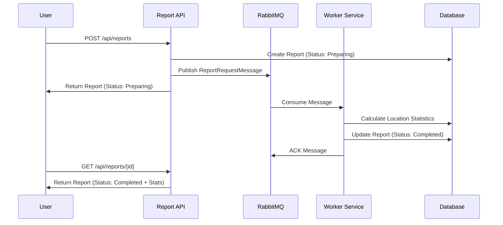

# Phone Registry System - .NET 8 CQRS Microservices

Modern telefon rehberi yönetimi için CQRS mimarisi ile geliştirilmiş mikroservis sistemi.

## 🎯 Hızlı Başlangıç - 3 Adımda Çalıştır!

```bash
# 1. Projeyi klonla
git clone <repo-url> && cd PhoneRegistrySystem

# 2. Docker ile başlat (tek komut!)
docker-compose up -d

# 3. Uygulamayı aç
# http://localhost:4200 (Angular Frontend)
# http://localhost:5000/swagger (Contact API)
# http://localhost:5001/swagger (Report API)
```

**Bu kadar! 🚀** Hiçbir şey kurmanıza gerek yok, sadece Docker Desktop yeterli.

## 🏗️ Mimari

- **Domain Layer**: Entities, Value Objects, Repository Interfaces
- **Application Layer**: CQRS Commands/Queries, Handlers, DTOs, Validators
- **Infrastructure Layer**: EF Core, PostgreSQL, Redis, RabbitMQ
- **Contact API**: Kişi ve iletişim bilgileri yönetimi
- **Report API**: Asenkron rapor oluşturma
- **Worker Service**: Background işlemler için RabbitMQ consumer

### 🔄 Asenkron İşlem Mimarisi



## 🚀 Teknolojiler

### Backend
- **.NET 8.0** - Web API
- **PostgreSQL** - Ana veritabanı
- **Redis** - Cache
- **RabbitMQ** - Message Queue (Persistent)
- **Worker Service** - Background processing
- **Entity Framework Core 8.0**
- **AutoMapper** - Object mapping
- **FluentValidation** - Input validation
- **Serilog** - Structured logging

### Frontend
- **Angular 17** - Modern SPA framework
- **Angular Material** - UI component library
- **Bootstrap 5** - CSS framework
- **TypeScript** - Type-safe development
- **RxJS** - Reactive programming

### DevOps
- **Docker & Docker Compose**
- **Nginx** - Web server

## 📋 Gereksinimler

- Docker Desktop
- .NET 8 SDK (opsiyonel, sadece development için)

## 🐳 Hızlı Başlangıç (Docker) - ÖNERİLEN

### Gereksinimler
- **Docker Desktop** (Windows/Mac/Linux)
- Başka hiçbir şey! PostgreSQL, Redis, RabbitMQ otomatik gelir.

### 1. Projeyi İndirin
```bash
git clone <repo-url>
cd PhoneRegistrySystem
```

### 2. TEK KOMUT İLE ÇALIŞTIRIN! 🚀
```bash
docker-compose up -d
```
Bu komut:
- ✅ PostgreSQL veritabanını başlatır
- ✅ Redis cache'ini başlatır  
- ✅ RabbitMQ message queue'unu başlatır
- ✅ Contact API'sini başlatır (Port: 5000)
- ✅ Report API'sini başlatır (Port: 5001)

### 3. API'ları Test Edin! 🌐

#### Swagger UI'lar (Tarayıcıda açın):
- **Contact API Swagger**: http://localhost:5000/swagger
- **Report API Swagger**: http://localhost:5001/swagger

#### Direkt API Endpoints:
- **Contact API**: http://localhost:5000
- **Report API**: http://localhost:5001

#### Yönetim Panelleri:
- **RabbitMQ Management**: http://localhost:15672 
  - Kullanıcı: `admin`
  - Şifre: `admin123`

### 4. Sistem Durumunu Kontrol Edin
```bash
# Tüm servislerin durumunu göster
docker-compose ps

# Servislerin loglarını izle
docker-compose logs -f

# Sadece Contact API loglarını izle  
docker-compose logs -f contact-api
```

### 5. Sistemi Durdurma/Temizleme
```bash
# Servisleri durdur (veriler korunur)
docker-compose down

# Servisleri durdur + verileri sil
docker-compose down -v

# Yeniden başlat
docker-compose up -d
```

## 💻 Local Development

### Gereksinimler
- .NET 8 SDK
- PostgreSQL (Docker ile: `docker run -d -p 5432:5432 -e POSTGRES_PASSWORD=postgres123 postgres:15`)
- Redis (Docker ile: `docker run -d -p 6379:6379 redis:7-alpine`)

### Çalıştırma
```bash
# Contact API
dotnet run --project PhoneRegistry.ContactApi

# Report API  
dotnet run --project PhoneRegistry.ReportApi
```

## 📡 API Endpoints

### Contact API (Port: 5000)
```
GET    /api/persons              # Kişi listesi
GET    /api/persons/{id}         # Kişi detayı
POST   /api/persons              # Kişi oluşturma
DELETE /api/persons/{id}         # Kişi silme
POST   /api/persons/{id}/contact-infos  # İletişim bilgisi ekleme
DELETE /api/contact-infos/{id}   # İletişim bilgisi silme
```

### Report API (Port: 5001)
```
POST   /api/reports              # Rapor talebi
GET    /api/reports              # Rapor listesi
GET    /api/reports/{id}         # Rapor detayı
```

## 📊 API Kullanım Örnekleri

### 🔥 Swagger UI Kullanımı (ÖNERİLEN)
1. **http://localhost:5000/swagger** adresine gidin
2. **"Try it out"** butonuna tıklayın
3. Request body'yi doldurun
4. **"Execute"** butonuna tıklayın
5. Response'u göreceksiniz!

### 💻 cURL Komutları

#### 1. Kişi Oluşturma
```bash
curl -X POST "http://localhost:5000/api/persons" \
  -H "Content-Type: application/json" \
  -d '{
    "firstName": "Ahmet",
    "lastName": "Yılmaz", 
    "company": "ABC Şirketi"
  }'
```

#### 2. Tüm Kişileri Listeleme
```bash
curl -X GET "http://localhost:5000/api/persons"
```

#### 3. Kişi Detayı Getirme
```bash
curl -X GET "http://localhost:5000/api/persons/{personId}"
```

#### 4. İletişim Bilgisi Ekleme
```bash
# Telefon numarası ekleme (type: 1)
curl -X POST "http://localhost:5000/api/persons/{personId}/contact-infos" \
  -H "Content-Type: application/json" \
  -d '{
    "type": 1,
    "content": "+905551234567"
  }'

# Email ekleme (type: 2)  
curl -X POST "http://localhost:5000/api/persons/{personId}/contact-infos" \
  -H "Content-Type: application/json" \
  -d '{
    "type": 2,
    "content": "ahmet@example.com"
  }'

# Konum ekleme (type: 3)
curl -X POST "http://localhost:5000/api/persons/{personId}/contact-infos" \
  -H "Content-Type: application/json" \
  -d '{
    "type": 3,
    "content": "İstanbul"
  }'
```

#### 5. Rapor Talebi
```bash
curl -X POST "http://localhost:5001/api/reports" \
  -H "Content-Type: application/json"
```

#### 6. Rapor Listesi
```bash
curl -X GET "http://localhost:5001/api/reports"
```

#### 7. Rapor Detayı
```bash
curl -X GET "http://localhost:5001/api/reports/{reportId}"
```

### 🌐 Postman Collection
Postman kullanıyorsanız, Swagger'dan **"Download"** → **"Postman Collection"** seçeneğiyle collection'ı indirebilirsiniz.

## 🔧 Konfigürasyon

### Connection Strings
```json
{
  "ConnectionStrings": {
    "DefaultConnection": "Host=postgres;Database=PhoneRegistryDb;Username=postgres;Password=postgres123",
    "Redis": "redis:6379"
  }
}
```

### İletişim Bilgisi Türleri
- `1`: Telefon Numarası
- `2`: E-mail Adresi  
- `3`: Konum

### Rapor Durumları
- `1`: Hazırlanıyor
- `2`: Tamamlandı
- `3`: Başarısız

## 🧪 Test Etme

### Unit Tests
```bash
dotnet test
```

### API Tests (Swagger UI)
1. http://localhost:5000/swagger adresine gidin
2. API endpoints'lerini test edin
3. Request/Response örneklerini inceleyin

## 📁 Proje Yapısı

```
PhoneRegistrySystem/
├── PhoneRegistry.Domain/          # Domain katmanı
├── PhoneRegistry.Application/     # CQRS Commands/Queries
├── PhoneRegistry.Infrastructure/  # Data Access, External Services
├── PhoneRegistry.ContactApi/      # Contact REST API
├── PhoneRegistry.ReportApi/       # Report REST API
├── PhoneRegistry.WorkerService/   # Background Processing Service
├── PhoneRegistry.Tests/           # Unit Tests
├── rabbitmq-config/              # RabbitMQ Configuration
├── docker-compose.yml            # Docker Compose konfigürasyonu
└── README.md                     # Bu dosya
```

## 🔍 CQRS Pattern

### Commands (Write Operations)
- `CreatePersonCommand` - Kişi oluşturma
- `DeletePersonCommand` - Kişi silme
- `AddContactInfoCommand` - İletişim bilgisi ekleme
- `RequestReportCommand` - Rapor talebi

### Queries (Read Operations)  
- `GetPersonByIdQuery` - Kişi detayı
- `GetAllPersonsQuery` - Kişi listesi
- `GetReportByIdQuery` - Rapor detayı

## 🐰 RabbitMQ ve Background Processing

### 🚨 Problem: Senkron Rapor İşlemi

```csharp
// ❌ KÖTÜ YAKLAŞIM - API Controller'da
[HttpPost]
public async Task<Report> CreateReport()
{
    var report = new Report();
    
    // ⚠️ Bu işlem 10-30 saniye sürebilir!
    var persons = await _db.Persons.Include(p => p.ContactInfos).ToListAsync();
    var locationStats = CalculateLocationStatistics(persons); // AĞIR İŞLEM
    
    report.LocationStatistics = locationStats;
    report.Status = ReportStatus.Completed;
    
    return report; // 30 saniye sonra döner!
}
```

**Sorunlar:**
- 🐌 **Slow Response**: Frontend 30 saniye bekler
- 💥 **Timeout Risk**: HTTP timeout olabilir  
- 🔒 **Resource Lock**: Database connection uzun süre meşgul
- 📱 **Poor UX**: Kullanıcı bekler, sayfa donabilir

### ✅ Çözüm: Asenkron İşlem (Background Worker)

```csharp
// ✅ İYİ YAKLAŞIM - API Controller'da
[HttpPost]
public async Task<Report> CreateReport()
{
    var report = new Report { Status = ReportStatus.Preparing };
    await _db.Reports.AddAsync(report);
    await _db.SaveChangesAsync();
    
    // Message kuyruğa gönder - 1ms
    await _messagePublisher.PublishAsync(
        new ReportRequestMessage(report.Id, DateTime.UtcNow),
        "report-processing-queue"
    );
    
    return report; // ⚡ Hemen döner!
}
```

### 🔧 Background Service Nedir?

```csharp
public class Worker : BackgroundService // .NET'in built-in sınıfı
{
    protected override async Task ExecuteAsync(CancellationToken stoppingToken)
    {
        // Bu method sürekli çalışır, uygulama kapanana kadar
        while (!stoppingToken.IsCancellationRequested)
        {
            // RabbitMQ'dan message dinle
            // İşlem yap
            // Database güncelle
        }
    }
}
```

### 🎯 Neden BackgroundService Kullandık?

**Alternativler:**
- ❌ **Windows Service**: Karmaşık, platform bağımlı
- ❌ **Console App + Cron**: Manuel scheduling, hata yönetimi zor
- ❌ **API içinde Thread**: Memory leak riski, lifecycle yönetimi zor
- ✅ **BackgroundService**: .NET built-in, kolay, cross-platform

### 🔄 Dependency Injection Scope Sorunu

#### **Problem:**
```
Error: Cannot consume scoped service 'RabbitMQConsumer' from singleton 'IHostedService'
```

#### **Sorunun Nedeni:**
```csharp
// ❌ SORUNLU KOD
public class Worker : BackgroundService  // Singleton lifetime
{
    private readonly RabbitMQConsumer<ReportRequestMessage> _consumer; // Scoped service!
    
    public Worker(RabbitMQConsumer<ReportRequestMessage> consumer) // ❌ Hata!
    {
        _consumer = consumer;
    }
}
```

**Problem:** 
- `Worker` = **Singleton** (uygulama boyunca 1 instance)
- `RabbitMQConsumer` = **Scoped** (her request/scope'da yeni instance)
- .NET DI Container: "Singleton bir service, Scoped service'i direkt alamaz!"

#### **Çözüm: IServiceProvider ile Scope Oluşturma** ✅
```csharp
// ✅ ÇÖZÜM - Manual scope management
public class Worker : BackgroundService
{
    private readonly IServiceProvider _serviceProvider; // Singleton
    
    protected override async Task ExecuteAsync(CancellationToken stoppingToken)
    {
        using var scope = _serviceProvider.CreateScope(); // Her seferinde yeni scope
        var consumer = scope.ServiceProvider.GetRequiredService<RabbitMQConsumer<ReportRequestMessage>>();
        // Consumer'ı kullan
        // scope dispose edilince consumer da temizlenir
    }
}
```

**Avantajları:**
- ✅ **DI Violation Yok**: Scope kuralları ihlal edilmiyor
- ✅ **Memory Management**: Proper dispose pattern
- ✅ **Database Connections**: DbContext doğru lifecycle'da
- ✅ **Testable**: Mock'lanabilir

### 💾 RabbitMQ Persistence (Mesajları Diske Kaydetme)

#### **Queue Durability:**
```csharp
channel.QueueDeclare(
    queue: "report-processing-queue",
    durable: true,      // ✅ Queue restart'ta kalır
    exclusive: false,   // ✅ Birden fazla consumer
    autoDelete: false,  // ✅ Queue otomatik silinmez
    arguments: null
);
```

#### **Message Persistence:**
```csharp
var properties = channel.CreateBasicProperties();
properties.Persistent = true;  // ✅ Message diske yazılır
```

#### **Manual ACK:**
```csharp
channel.BasicConsume(
    queue: queueName,
    autoAck: false,    // ✅ Manuel onay
    consumer: consumer
);

// İşlem başarılı
_channel.BasicAck(deliveryTag: ea.DeliveryTag, multiple: false);

// İşlem başarısız - tekrar dene
_channel.BasicNack(deliveryTag: ea.DeliveryTag, multiple: false, requeue: true);
```

#### **Disk Persistence Garantileri:**

**RabbitMQ Config (`rabbitmq.conf`):**
- ✅ **Durable Queues**: Restart'ta queue'lar kalır
- ✅ **Persistent Messages**: Mesajlar diske yazılır  
- ✅ **Manual ACK**: İşlem tamamlanmadan mesaj silinmez
- ✅ **Requeue on Error**: Hata durumunda tekrar dene

**Senaryo Testi:**
1. 🚀 **Message gönder** → RabbitMQ'ya ulaşır
2. 💥 **RabbitMQ restart** → Message kaybolmaz (disk'te)
3. 🔄 **Worker restart** → Message tekrar işlenir
4. ❌ **İşlem başarısız** → Message requeue edilir
5. ✅ **İşlem başarılı** → Message ACK ile silinir

### ⚡ Performance Avantajları

**Senkron vs Asenkron:**
```
Senkron:  API Request ──────────────────────── 30s ──────────────────────── Response
                      [User bekliyor, sayfa donuk]

Asenkron: API Request ── 50ms ── Response
                                  ↓
          Background:             Message → Worker → DB Update
                                  [User başka işler yapabilir]
```

### 🎛️ RabbitMQ Management

#### **RabbitMQ Management UI:**
- **URL**: http://localhost:15672
- **Username**: `admin`
- **Password**: `admin123`

#### **Queue Monitoring:**
- Queue durumu (message count, consumer count)
- Message rate (publish/consume)
- Memory kullanımı
- Disk kullanımı

#### **Configuration:**
```bash
# RabbitMQ Config Dosyası: rabbitmq-config/rabbitmq.conf
default_queue_type = quorum
disk_free_limit.absolute = 1GB
vm_memory_high_watermark.absolute = 1GB
msg_store_file_size_limit = 16777216
```

### 🔄 Message Flow



**Sonuç:** Worker Service + RabbitMQ ile hem **user experience** hem **system reliability** kazanıyoruz! 🎉

## 🐛 Sorun Giderme

### ❌ Docker Desktop Çalışmıyor
```bash
# Docker Desktop'ın çalıştığını kontrol edin
docker version

# Çalışmıyorsa Docker Desktop'ı başlatın
```

### ❌ Port Çakışması (Port zaten kullanılıyor)
```bash
# Hangi portların kullanıldığını kontrol edin
netstat -an | findstr :5000
netstat -an | findstr :5001
netstat -an | findstr :5432

# Çakışan servisleri durdurun veya port değiştirin
docker-compose down
```

### ❌ Container'lar Başlamıyor
```bash
# Detaylı log'ları kontrol edin
docker-compose logs

# Belirli bir container'ın logunu kontrol edin
docker-compose logs contact-api
docker-compose logs postgres
docker-compose logs redis
docker-compose logs worker-service

# Container'ları yeniden başlatın
docker-compose restart
```

### ❌ API'lar 404 Hatası Veriyor
```bash
# Container'ların durumunu kontrol edin
docker-compose ps

# Eğer "Exited" durumunda ise:
docker-compose up -d

# API'ların hazır olmasını bekleyin (30-60 saniye)
```

### ❌ Veritabanı Bağlantı Hatası
```bash
# PostgreSQL container'ının sağlıklı olduğunu kontrol edin
docker-compose ps postgres

# PostgreSQL'i yeniden başlatın
docker-compose restart postgres

# Veritabanı migration'larını çalıştırın
docker exec -it phoneregistry-contact-api dotnet ef database update
```

### ❌ RabbitMQ Bağlantı Sorunu
```bash
# RabbitMQ container'ının sağlıklı olduğunu kontrol edin
docker-compose ps rabbitmq

# RabbitMQ loglarını kontrol edin
docker-compose logs rabbitmq

# RabbitMQ Management UI'ye erişin
# http://localhost:15672 (admin/admin123)

# Queue'ları kontrol edin
# Queues tab'ında "report-processing-queue" olmalı
```

### ❌ Worker Service Çalışmıyor
```bash
# Worker Service loglarını kontrol edin
docker-compose logs worker-service

# Worker Service'i yeniden başlatın
docker-compose restart worker-service

# Worker Service'in çalışıp çalışmadığını kontrol edin
docker-compose ps worker-service

# Manuel olarak Worker Service'i test edin
dotnet run --project PhoneRegistry.WorkerService
```

### ❌ Rapor "Preparing" Durumunda Kalıyor
```bash
# 1. Worker Service çalışıyor mu?
docker-compose ps worker-service

# 2. RabbitMQ'da message var mı?
# http://localhost:15672 → Queues → report-processing-queue

# 3. Worker Service loglarında hata var mı?
docker-compose logs worker-service --tail=50

# 4. Database'de rapor durumu nedir?
docker exec -it phoneregistry-postgres psql -U postgres -d PhoneRegistryDb -c "SELECT Id, Status, RequestedAt FROM Reports ORDER BY RequestedAt DESC LIMIT 5;"
```

### ❌ "Dependency Injection Scope" Hatası
```
Error: Cannot consume scoped service 'RabbitMQConsumer' from singleton 'IHostedService'
```

**Çözüm:**
```csharp
// Worker.cs dosyasında IServiceProvider kullanın
public Worker(IServiceProvider serviceProvider)
{
    _serviceProvider = serviceProvider;
}

protected override async Task ExecuteAsync(CancellationToken stoppingToken)
{
    using var scope = _serviceProvider.CreateScope();
    var consumer = scope.ServiceProvider.GetRequiredService<RabbitMQConsumer<ReportRequestMessage>>();
    // ...
}
```

### ❌ "Image not found" Hatası
```bash
# Docker cache'ini temizleyin
docker system prune -a

# Yeniden build edin
docker-compose build --no-cache
docker-compose up -d
```

### ✅ Tüm Sistemi Sıfırlama
```bash
# UYARI: Tüm veriler silinir!
docker-compose down -v
docker system prune -a
docker-compose up -d
```

### 📋 Sistem Durumu Kontrol Komutları
```bash
# Tüm container'ların durumu
docker-compose ps

# Sistem kaynaklarını kontrol et
docker stats

# Container'ların detaylı bilgisi
docker-compose top

# Network bağlantılarını kontrol et
docker network ls
```

### 🔍 Log Takibi
```bash
# Tüm servislerin canlı logları
docker-compose logs -f

# Sadece API logları
docker-compose logs -f contact-api report-api

# Son 50 satır log
docker-compose logs --tail=50

# Belirli bir zaman aralığındaki loglar
docker-compose logs --since="2024-01-01T00:00:00"
```

## 📝 Lisans

Bu proje MIT lisansı altında lisanslanmıştır.

---

**Geliştirici Notları**: Bu proje Clean Architecture, CQRS pattern ve Domain-Driven Design prensiplerine uygun olarak geliştirilmiştir. Production ortamı için environment variables ve secret management kullanılması önerilir.